Hello readers, today’s post covers a challenge I recently solved. While preparing for my final semester, I didn’t have the opportunity to share everything earlier, but I’m glad to finally publish my solution. This challenge comes from Fetch The Flag 2026 by Snyk, and it's special for me because the first CTF I participated in was from the same team.

Hosted at https:[//ctf.snyk.io/](https://ctf.snyk.io/)

# Forensics—Void Step

You're a SOC analyst at Sfax-Tech. Your team lead rushes in: "A client server triggered multiple alerts. The system isolated it and saved the traffic." She hands you a USB with a PCAP file. Find out what happened. Time is critical.

Download: [Net-Traffic.pcap.zip](https://purpleshonen.fyi/downloadables/Net-Traffic.pcap.zip)

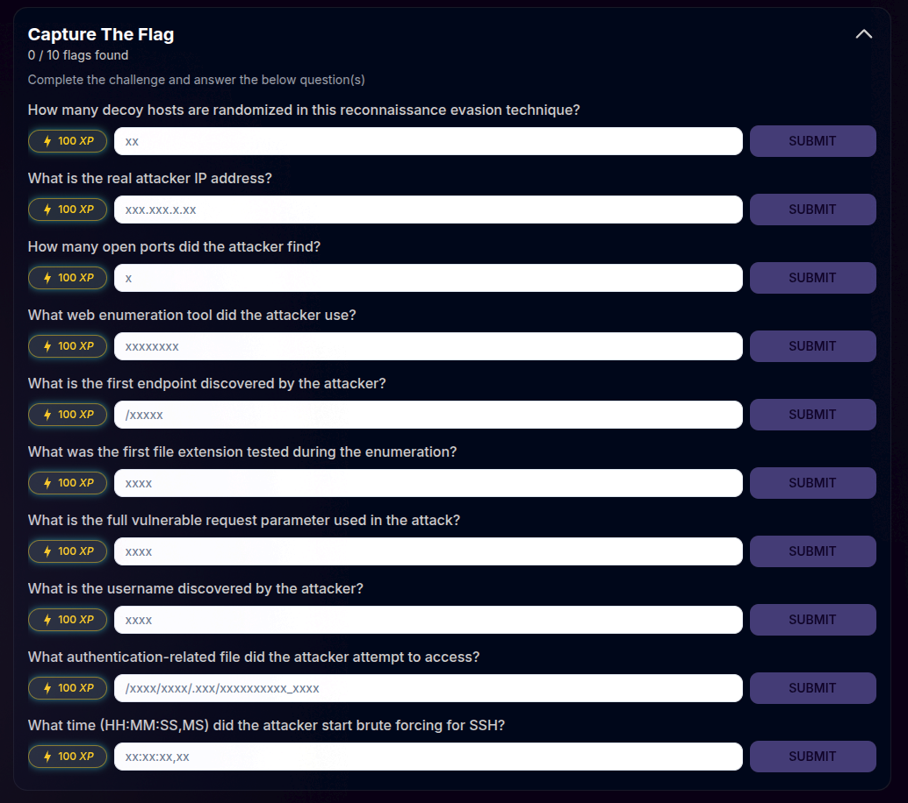

## Solution

I have used Wireshark to investigate the PCAP file, and there are multiple options such as TShark or tcpdump for analysis in the command-line interface. I chose Wireshark because I have been practicing network analysis with Wireshark for a while, and I wanted to test my skills with this challenge.

1. How many decoy hosts are randomized in this reconnaissance evasion technique?

Decoy IP addresses are used by the attacker to evade detection and avoid getting blocked and to create enough noise to hide the attacker's real IP. There are multiple ways to detect that through various techniques, such as checking the TTL for the packets, as it's the same for the decoy IPs or packet size.

I started off with discovering the host, and by checking the endpoints with the most traffic/packets, I was able to pinpoint the host.

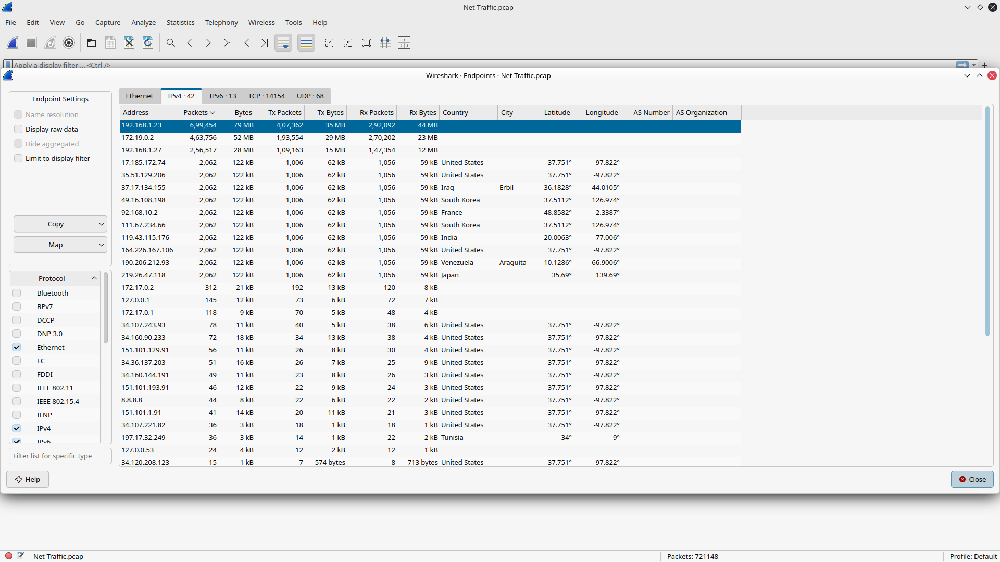

Then I applied the filter to track every syn-ack packet sent to the host.

```plain
tcp.flags.syn==1 && tcp.flags.ack==1 && ip.src == 192.168.1.27
```

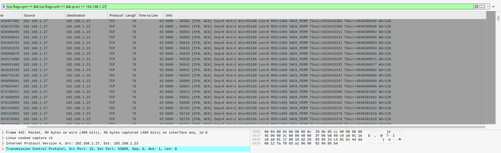

Finally, I went to the conversations option in the statistics tab to see all the IPs interacting with the host with those filters.

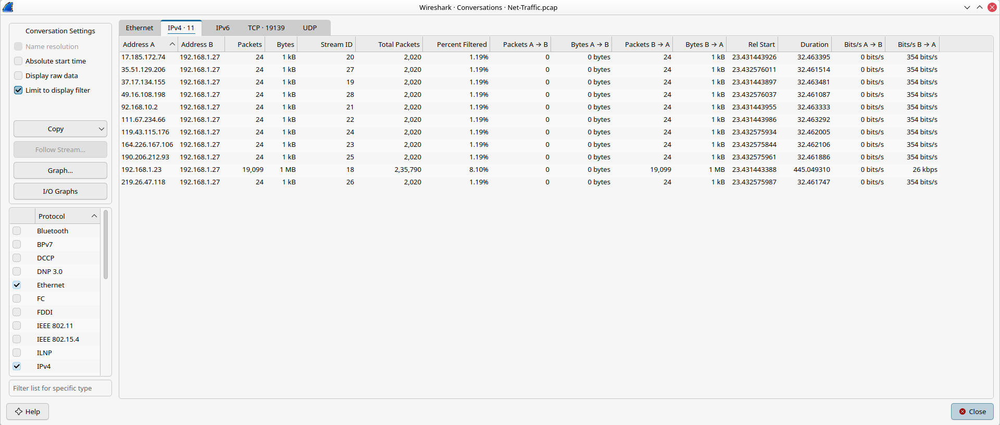

**Answer:** 11

2. What is the real attacker IP address?

From the conversations option, we can see that aside from the host, this IP has different traffic volume and isn't identical to the decoys.

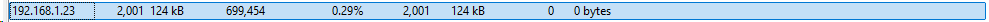

**Answer:** 192.168.1.23

3. How many open ports did the attacker find?

I used another option to find out the ports that are accessed multiple times with IPv4 statistics from the statistics menu, and after applying the filter I was able to see the four ports being accessed more than 2 times.

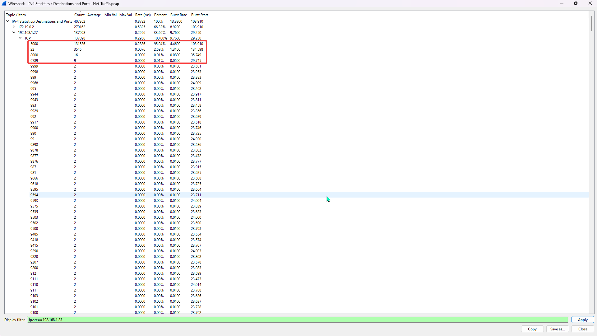

**Answer:** 4

4. What web enumeration tool did the attacker use?

A simple HTTP request filter helped me filter out the various requests made by the attacker, and the name of the tool was in the User-Agent.

```plain
http.request
```

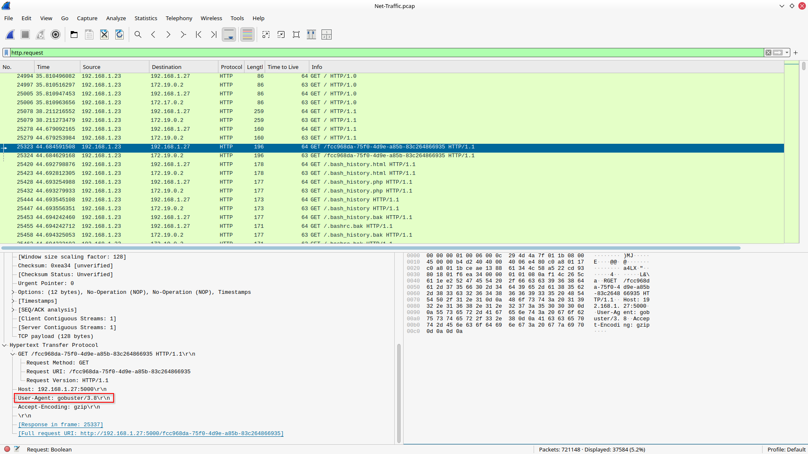

**Answer:** gobuster

5. What is the first endpoint discovered by the attacker?

After applying the filter to get a 200 OK response, I was able to see which endpoint was discovered first by the attacker.

```plain
http.response.code == 200
```

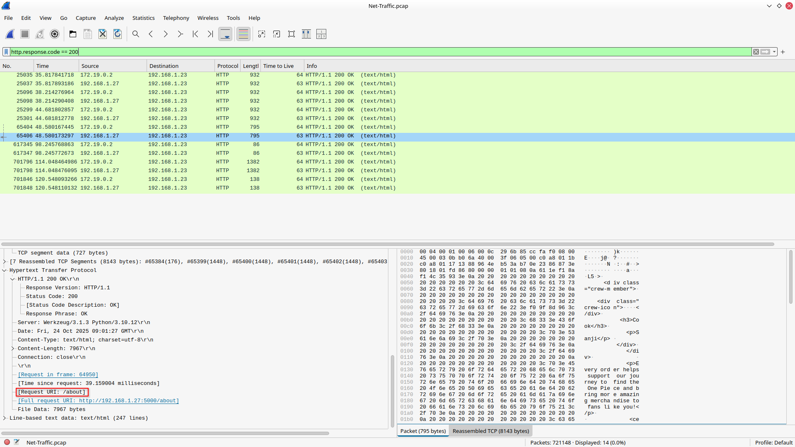

**Answer:** /about

6. What was the first file extension tested during the enumeration?

I used the "contains" operator to filter out the request URI with a period to see all the extensions.

```plain
http.request.uri contains "."
```

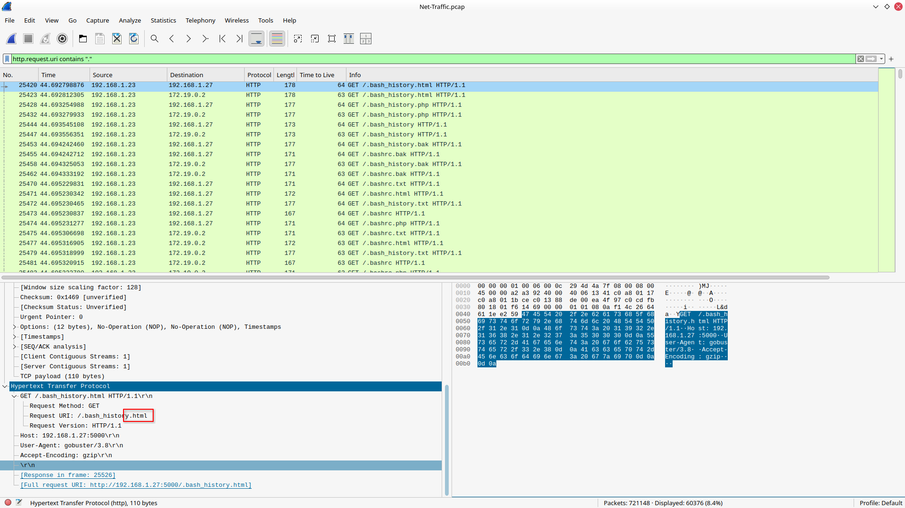

**Answer:** html

7. What is the full vulnerable request parameter used in the attack?

When I was looking for the discovered endpoints, I did find the parameter that was used to carry out the attack.

```plain
http.response.code == 200
```

**Answer:** file

8. What is the username discovered by the attacker?

After following the stream of the packet used to execute the attack, I was able to see the exposed username.

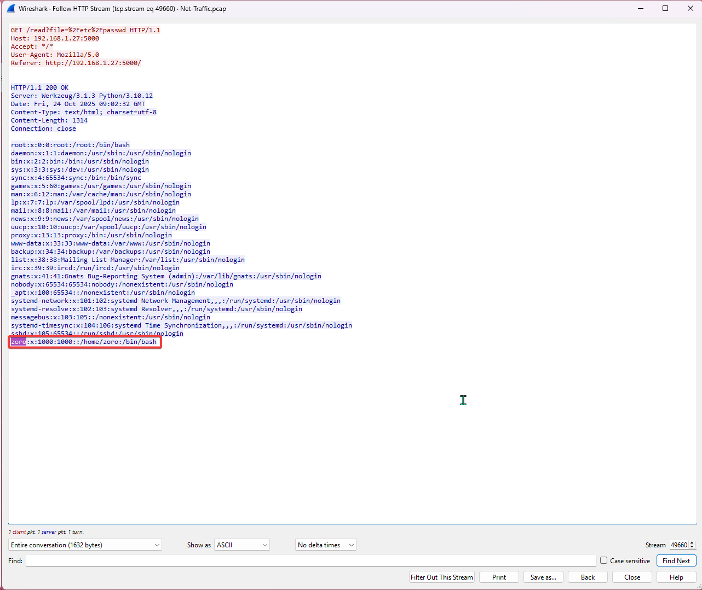

**Answer:** zoro

9. What authentication-related file did the attacker attempt to access?

I went through all the files that were exposed with this vulnerability called "Local File Inclusion (LFI)," which allowed the attacker to read the system files, could be dangerous; in such a scenario, someone might be able to access the SSH keys.


**Answer:** /home/zoro/.ssh/authorized_keys

10. What time (HH:MM:SS,MS) did the attacker start brute-forcing for SSH?

I used the SSH filter to discover when the attack started, and it was fairly simple.

```plain
ssh
```

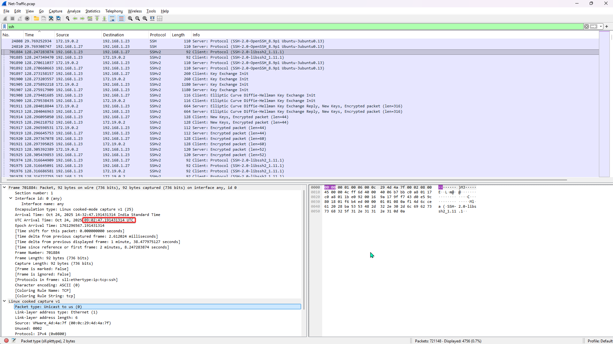

**Answer:** 09:02:47,19

**Conclusion:** I had a lot of fun solving these challenges, as it was right up my alley since I am preparing for an SOC L1 role. Being able to analyze network traffic is one of the core parts of triage and incident response.
