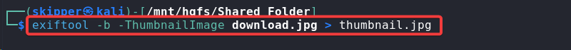
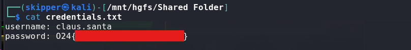
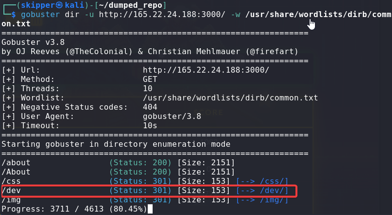
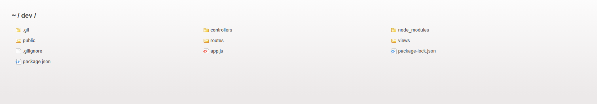
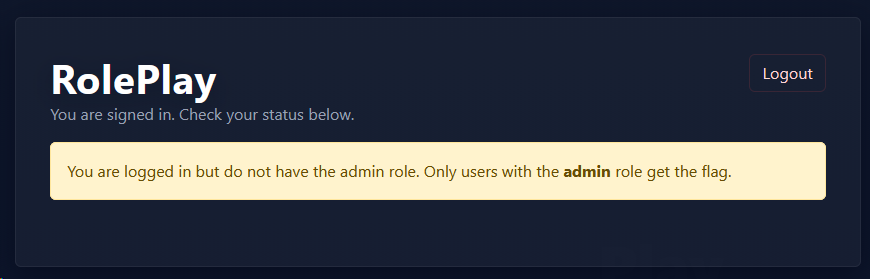
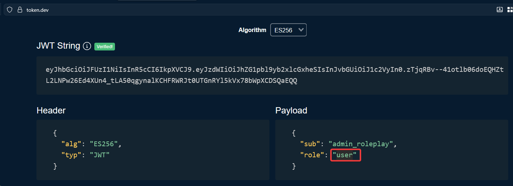
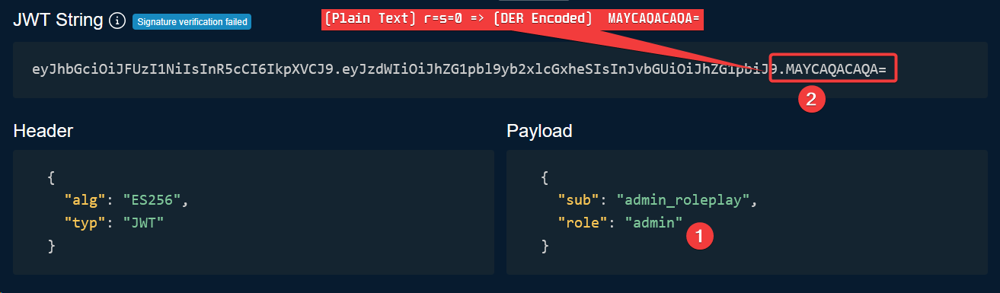

Today, I am tackling a CTF conducted by Outpost24, a cybersecurity company that provides exposure management solutions. Without further ado, let’s get started.

Hosted at: https://ctf.samurai.nu

## Category: Stego

#### WARMUP: Stego


`For centuries, people have used holiday greetings to send more than just good wishes. Long before digital encryption existed, secret messages were hidden in plain sight. You could hide your secrets between the lines of handwritten postcards, in patterns, codes, or subtle markings no ordinary observer would ever notice.`

`During World War II, intelligence agents used seemingly harmless Christmas cards to pass confidential information. A misplaced snowflake, a shifted word, or an unusual ornament could carry instructions across borders, right under the enemy’s nose.`

`Today, the tradition lives on but pixels have replaced paper, and messages can be concealed anywhere inside an image…`

Download: [stego.jpg](/downloadables/stego.jpg)

After downloading the image from the challenge, since this is a steganography challenge, I started by attempting to extract hidden data using the common rockyou wordlist.

I used a tool called [stegcracker](https://www.kali.org/tools/stegcracker/), which a brute-force utility. If it's not installed on your machine, then install it first.

```
sudo apt install stegcracker
```

I used the following command to crack the file.

```
stegcracker stego.jpg /usr/share/wordlists/rockyou.txt
```


Bingo! I was able to get the flag in the stego.jpg.out file.

#### Reindeer Rebellion

`Chaos has hit the North Pole. Candy canes litter the floor, elves are tangled in tinsel, and the reindeer have found Santa’s naughty list, the master record of who gets coal. They’re plotting to rewrite it, and if they succeed, Christmas is doomed.`

`You rush to Santa, half-buried under ornaments and snoring into his eggnog. “Santa! We need you!” you shout. He mumbles, “Little… thumb… tiny… key…” and hands you a USB stick before collapsing, snoring, into the ornaments again.`

`Stored on the USB is a text file with a hidden secret. The ancient PC guarding the naughty list won’t accept any commands unless you log in as Santa. Can you uncover the secret before the reindeer rewrite Christmas?`

Download: [christmas.txt](/downloadables/christmas.txt)

After inspecting the file, the contents were found to be Base64 encoded. I opened [CyberChef](https://cyberchef.io), decoded the content, and rendered it using the Render Image operation.


Proceeding with the rendered image and the hint given in the description, “Little… thumb… tiny… key…”, I extracted the thumbnail from the image using exiftool.

```
exiftool -b -ThumbnailImage download.jpg > thumnail.jpg
```



The extracted thumbnail contained the password needed to decrypt the hidden text. 

```
steghide extract -sf download.jpg
```


The credentials.txt file had the flag.

```
cat credentials.txt
```



## Category: Web

#### Silent Knight

`It’s the holiday season, and the legendary rock band Silent Knight just launched their first version of their Christmas blog to start spreading some digital cheer and drop exclusive behind-the-scenes stories from their Frostbyte Tour. But between rehearsals, eggnog-fueled coding sessions, and too many blinking LEDs, the band might’ve pushed more than just festive introductions to production...`

Upon reviewing the site, it showed that it had only two pages, but to uncover any hidden pages, I ran Gobuster. 

```
gobuster dir -u http://<ip>:<port>/ -w /usr/share/wordlists/dirb/common.txt
```



After visiting the /dev/ directory, I found a .git repository.



To locally reconstruct the exposed source code repository, I used the [git-dumper](https://github.com/arthaud/git-dumper) tool.

```
git-dumper http://<ip>:<port>/dev/.git dumped_repo
```


After thoroughly analyzing the exposed .git repository, I discovered one part of the flag in the message of the initial commit.

```
git log --reverse
```


While looking at the other commits, I noticed the credentials were hardcoded into the \`LoginController.js\`, which was the second part of the flag.

```
git show 46ef1dc
```


#### Roleplay


`Everyone has a role to play. Some roles are easy to obtain… but others almost require psychic abilities.`

`Which role will you take?`

Hosted at: https://roleplay.appsec.nu

After checking the site, it had two pages, other than the homepage, \`/auth/login\`, and \`/auth/register\`. The register page didn’t allow public registration of an admin, so I made an account. 


Once the account was registered, I was shown the “You are logged in, but do not have admin role. Only users with the admin role get the flag.”



Since the challenge description mentions it’s about roles, I checked the Cookies and found out the JWT Token. 


I used [token.dev](https://token.dev/) to decode and review the payload, discovered the role key, and updated its value. 



After going back and forth and a bit of research, I found a vulnerability: [CVE-2022-21449: Psychic Signatures](https://www.securecodewarrior.com/article/psychic-signatures), which could be used to bypass the signature checks at the back-end. 

> Psychic Signatures allows ECDSA signature verification to be bypassed in vulnerable Java versions by accepting invalid signatures.



I updated the original JWT by replacing it with a modified version.


Bingo! After refresh, the flag was revealed.


Thank you so much for reading my write-up. This is my first attempt at writing one. I will continue to improve my writing style as I participate in more CTFs.
