Greetings, this is my second write-up, and today I’ll be walking through the Bandit Wargames by [OverTheWire](https://overthewire.org/wargames/). [Bandit](https://overthewire.org/wargames/bandit/) is a beginner-friendly, level-based wargame focused on Linux, and it’s a great way to sharpen your command-line skills while learning new concepts along the way.

In this walkthrough, I’ll focus on explaining my approach to solving each level, including the commands I use and the reasoning behind them. To keep things fair and spoiler-free, all passwords have been censored so you can follow the process yourself and fully enjoy the game.

# Level 0

The goal of this level is for you to log into the game using SSH. The host to which you need to connect is [bandit.labs.overthewire.org](http://bandit.labs.overthewire.org/), on port 2220. The username is bandit0 and the password is bandit0. Once logged in, go to the Level 1 page to find out how to beat Level 1.

* **Host**: bandit.labs.overthewire.org  
* **Port**: 2220  
* **Username**: bandit0

Once logged in, you can proceed to the Level 1 page to find out how to beat the next level.

***Solve***:
I firstly went to the manual page using the `man` command, and then used -p argument to provide the port, since we are not connecting on the default port.

```
ssh -p 2220 bandit0@bandit.labs.overthewire.org
```

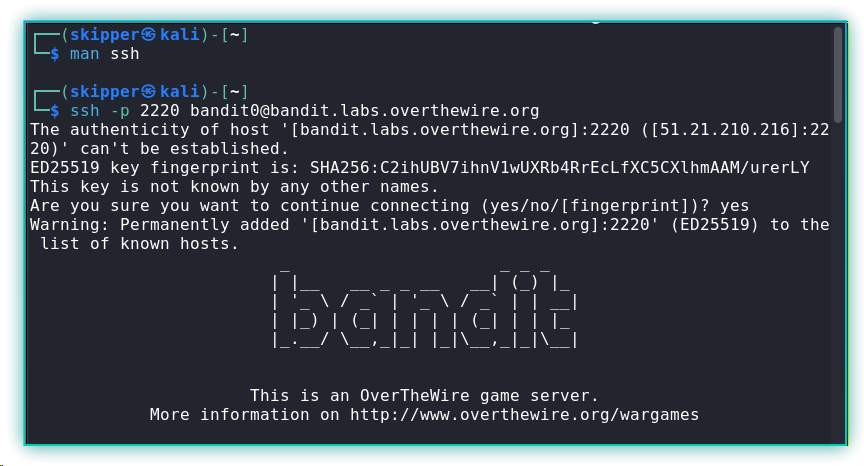

# Level 0 → Level 1

The password for the next level is stored in a file called `readme` located in the home directory. Use this password to log into bandit1 using SSH. Whenever you find a password for a level, use SSH (on port 2220) to log into that level and continue the game.

***Solve***:
After logging in with the credentials  provided on level 0, I found the `readme` file on the home directory, and used the `cat` command to read the content of it.


I used the password present in the `readme` file in the bandit0 account to login into the user bandit1.

# Level 1 → Level 2

The password for the next level is stored in a file called - located in the home directory

***Solve***:
After listing the files, I noticed a file named -. Attempting to access it directly does not work because a hyphen is interpreted as the start of a command-line option.\
To access such files, we explicitly specify the relative path using `./`.

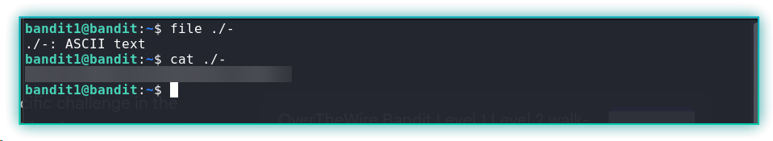

# Level 2 → Level 3

The password for the next level is stored in a file called `--spaces in this filename--` located in the home directory.

***Solve***:
To access files with spaces, you can use quotation marks, e.g., “file name", around the file name. Since the file name started with a hyphen, I had to use the relative path indicator.

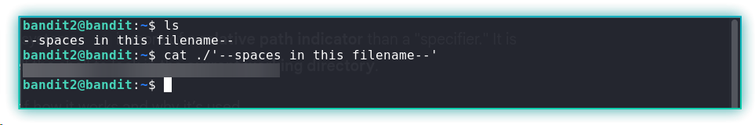

# Level 3 → Level 4

The password for the next level is stored in a hidden file in the inhere directory.

***Solve***:
After going into the inhere directory, it initially appeared empty. To display hidden files, I used the `-la` flags with ls, which revealed the hidden file.


# Level 4 → Level 5

The password for the next level is stored in the only human-readable file in the inhere directory. Tip: if your terminal is messed up, try the “reset” command.

***Solve***:
After inspecting the folder inhere, I saw that there are a few files, and only one of them contained the password for the next level, I choose to write a script.

I then wrote a loop to iterate through each file and print its contents.

```
for i in {0..9}; do
  echo -e "\nFile No.: $i\n"
  cat ./-file0$i
done
```


# Level 5 → Level 6

The password for the next level is stored in a file somewhere under the inhere directory and has all of the following properties:

* human-readable
* 1033 bytes in size
* not executable

***Solve***:

One key piece of information from the problem was the size property of the file, and after going through the man page, I was able to identify a way to find files of a specific size. \[Note: c is for bytes.]

```
find . -type f -size 1033c
```


# Level 6 → Level 7

The password for the next level is stored **somewhere on the server** and has all of the following properties:

* owned by user bandit7
* owned by group bandit6
* 33 bytes in size

***Solve***:
`find` is a very powerful command: not only can it locate files or directories, but it can also execute commands on them. I used the -size flag to narrow down the search, then the -exec option to display the file’s path. Finally, the output shows that the file is owned by the group bandit6.

```
find / -type f -size 33c 2>/dev/null -exec ls -la {} \; | grep bandit6
```


# Level 7 → Level 8

The password for the next level is stored in the file data.txt next to the word millionth

***Solve***:
The clue is the word "millionth," and I used the `grep` command to fetch the word.

```
grep millionth data.txt
```


# Level 8 → Level 9

The password for the next level is stored in the file **data.txt** and is the only line of text that occurs only once

***Solve***:
In this case, I had to sort the data to find the unique entries because the `uniq` command only compares it to the next line. That’s why I first sorted the data and piped the command.

```
sort data.txt | uniq -u
```


# Level 9 → Level 10

The password for the next level is stored in the file **data.txt** in one of the few human-readable strings, preceded by several ‘=’ characters.


***Solve***:
After inspecting the file, I noticed that it contained a lot of gibberish data, so I used the `strings` command to extract readable strings and piped the output to `grep` to print all lines containing `=`.

```
strings data.txt | grep "="
```

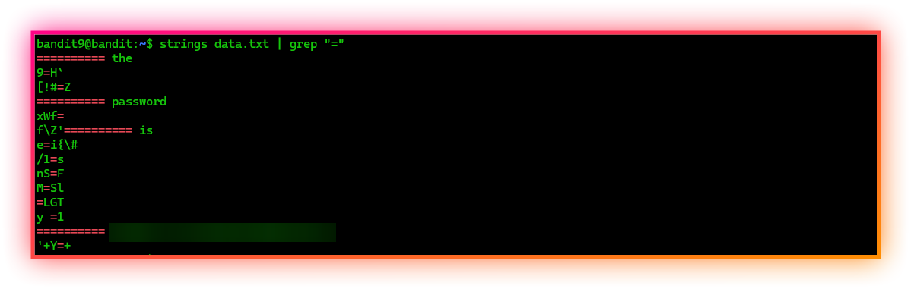

# Level 10 → Level 11

The password for the next level is stored in the file **data.txt**, which contains base64 encoded data


***Solve***:
In this level, all I had to do was use the `base64` command with the decode flag `-d` , and it revealed the password.

```
base64 -d data.txt
```


# Level 11 → Level 12

The password for the next level is stored in the file **data.txt**, where all lowercase (a-z) and uppercase (A-Z) letters have been rotated by 13 positions

***Solve:***

The reading material mentions rot13, which rotates an alphabet to the next 13th position alphabet; A becomes N, and N becomes O. To solve this level, I have used the `tr` command.

```
cat data.txt | tr 'A-Za-z' 'N-ZA-Mn-za-m'
```

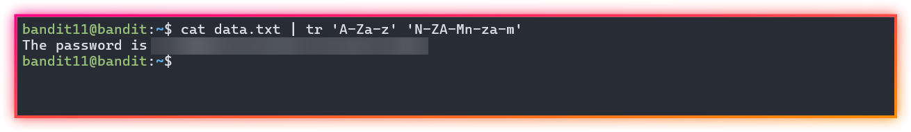

# Level 12 → Level 13

The password for the next level is stored in the file **data.txt**, which is a hexdump of a file that has been repeatedly compressed. For this level it may be useful to create a directory under /tmp in which you can work. Use mkdir with a hard to guess directory name. Or better, use the command “mktemp -d”. Then copy the datafile using cp, and rename it using mv (read the manpages!)

***Solve:***

Follow the instructions and create a folder in the `/tmp` folder, change the file name to `hexdump.txt`, and revert the file to the form it was using, using the `xxd` with the `-r` flag, which stands for reverse.

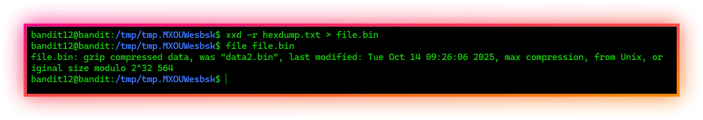

This part takes 7 decompressions to obtain the password.

```
tar -xvf <filename>
gzip -d <filename>
bzip2 -d <filename>
```

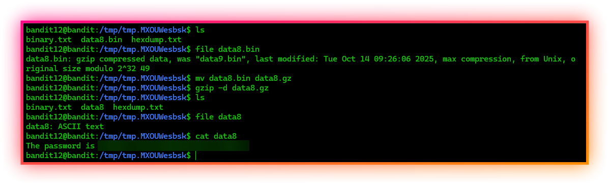

# Level 13 → Level 14

The password for the next level is stored in **/etc/bandit_pass/bandit14 and can only be read by user bandit14**. For this level, you don’t get the next password, but you get a private SSH key that can be used to log into the next level. Look at the commands that logged you into previous bandit levels, and find out how to use the key for this level.

***Solve:***
After logging in, I found the private SSH key for the bandit14 user, and I downloaded the key using the `scp` command, which is used for securely copying files over SSH.


```
scp -P 2220 bandit13@bandit.labs.overthewire.org:/home/bandit13/sshkey.private "C:\Users\rahul\Downloads\"
```

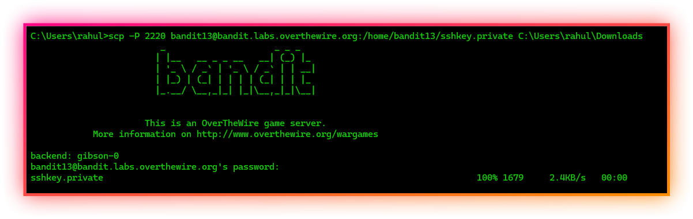

I tried to log in with the private key, but it prompted that it had bad permissions, so I used the `chmod` command, which is used to change the permissions of a file.


```
chmod 700 sshkey.private
```

Once proper permissions were set, I logged in with `-i` flag.

```
ssh -i sshkey.private -p 2220 bandit14@bandit.labs.overthewire.org
```

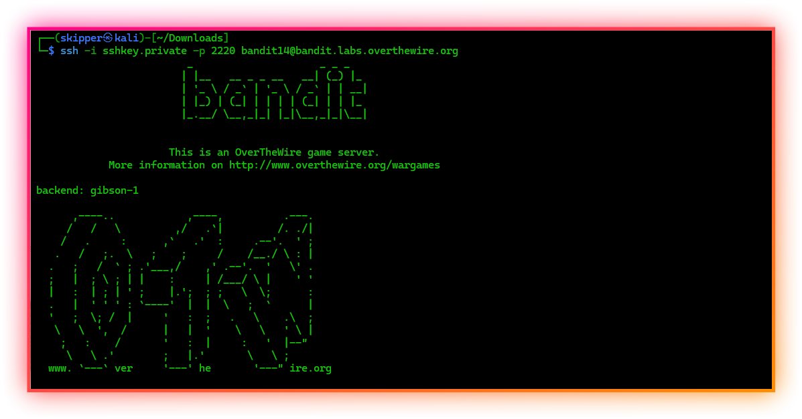

The file which had the password was already mentioned in the level.


# Level 14 → Level 15

The password for the next level can be retrieved by submitting the password of the current level to **port 30000 on localhost**.

***Solve:***

This was fairly simple; I used the `netcat` tool to connect to the 30000 port and gave the password I obtained before, and it gave me the password for the next level.

```
nc localhost 30000
```


```
telnet localhost 30000
```


# Level 15 → Level 16

The password for the next level can be retrieved by submitting the password of the current level to **port 30001 on localhost** using SSL/TLS encryption.

**Helpful note: Getting “DONE”, “RENEGOTIATING” or “KEYUPDATE”? Read the “CONNECTED COMMANDS” section in the man page.**

***Solve:***

I couldn’t use `nc` or `telnet` because they don’t support SSL/TLS, and I had to use the `ncat` utility, which is part of the nmap tool suite and supports SSL/TLS  (using the `--ssl` flag).

```
ncat --ssl localhost 30001
```


# Level 16 → Level 17

The credentials for the next level can be retrieved by submitting the password of the current level to **a port on localhost in the range 31000 to 32000**. First find out which of these ports have a server listening on them. Then find out which of those speak SSL/TLS and which don’t. There is only 1 server that will give the next credentials, the others will simply send back to you whatever you send to it.

**Helpful note: Getting “DONE”, “RENEGOTIATING” or “KEYUPDATE”? Read the “CONNECTED COMMANDS” section in the manpage.**

***Solve:***

Once I went through the manpage of the `nc` command, I discovered a flag that enumerates over a range of ports to see if they are open or not. I had just learned about process substitution and how to redirect stderr to stdout.

```
grep succeeded! <(nc -zv localhost 31000-32000 2>&1)
```


```
for p in <ports>; do
			 echo -e "\n Port: $p"
			 echo kSkvUpMQ7lBYyCM4GBPvCvT1BfWRy0Dx | ncat --ssl localhost $p -w 1
done
```

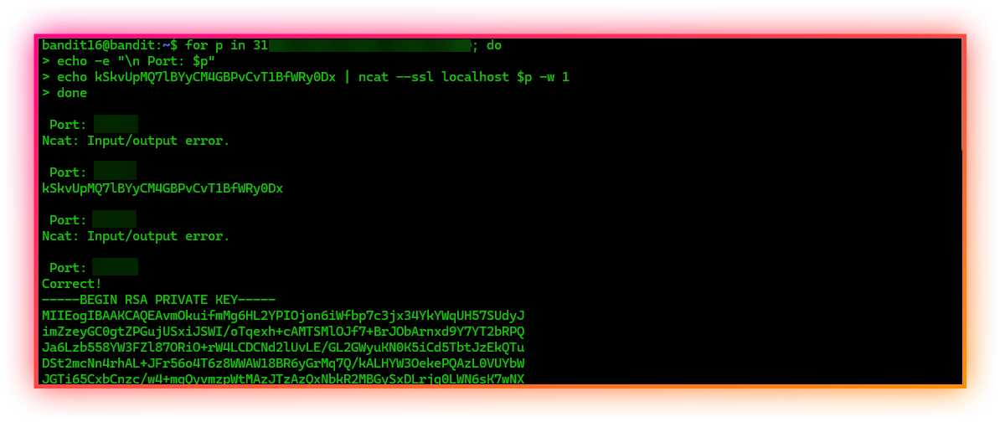

I copied the private key and put the content into a file and tried to log in with the key.

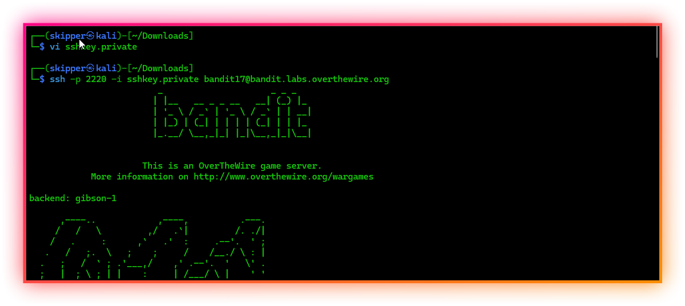


Furthermore, I’ll keep updating this write-up as I work through more levels and learn along the way.
