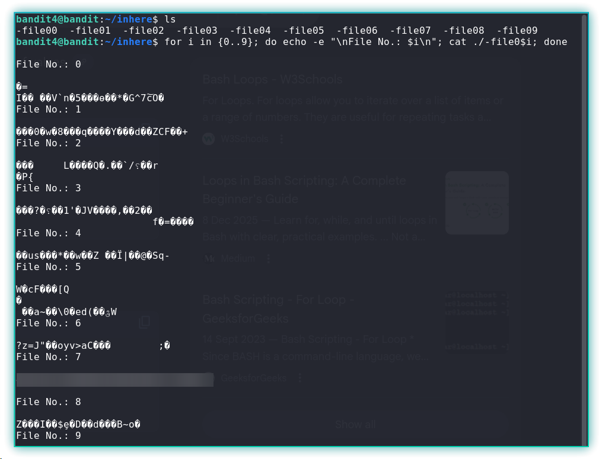

Greetings, this is my second write-up, and today I’ll be walking through the Bandit Wargames by [OverTheWire](https://overthewire.org/wargames/). [Bandit](https://overthewire.org/wargames/bandit/) is a beginner-friendly, level-based wargame focused on Linux, and it’s a great way to sharpen your command-line skills while learning new concepts along the way.

In this walkthrough, I’ll focus on explaining my approach to solving each level, including the commands I use and the reasoning behind them. To keep things fair and spoiler-free, all passwords have been censored so you can follow the process yourself and fully enjoy the game.

# Level 0

The goal of this level is for you to log into the game using SSH. The host to which you need to connect is [bandit.labs.overthewire.org](http://bandit.labs.overthewire.org/), on port 2220. The username is bandit0 and the password is bandit0. Once logged in, go to the Level 1 page to find out how to beat Level 1.

* **Host**: bandit.labs.overthewire.org  
* **Port**: 2220  
* **Username**: bandit0

Once logged in, you can proceed to the Level 1 page to find out how to beat the next level.

***Solve***:
I firstly went to the manual page using the `man` command, and then used -p argument to provide the port, since we are not connecting on the default port.

```
ssh -p 2220 bandit0@bandit.labs.overthewire.org
```


# Level 0 → Level 1

The password for the next level is stored in a file called `readme` located in the home directory. Use this password to log into bandit1 using SSH. Whenever you find a password for a level, use SSH (on port 2220) to log into that level and continue the game.

***Solve***:
After logging in with the credentials  provided on level 0, I found the `readme` file on the home directory, and used the `cat` command to read the content of it.


I used the password present in the `readme` file in the bandit0 account to login into the user bandit1.

# Level 1 → Level 2

The password for the next level is stored in a file called - located in the home directory

***Solve***:
After listing the files, I noticed a file named -. Attempting to access it directly does not work because a hyphen is interpreted as the start of a command-line option.\
To access such files, we explicitly specify the relative path using `./`.


# Level 2 → Level 3

The password for the next level is stored in a file called `--spaces in this filename--` located in the home directory.

***Solve***:
To access files with spaces, you can use quotation marks, e.g., “file name", around the file name. Since the file name started with a hyphen, I had to use the relative path indicator.


# Level 3 → Level 4

The password for the next level is stored in a hidden file in the inhere directory.

***Solve***:
After going into the inhere directory, it initially appeared empty. To display hidden files, I used the `-la` flags with ls, which revealed the hidden file.


# Level 4 → Level 5

The password for the next level is stored in the only human-readable file in the inhere directory. Tip: if your terminal is messed up, try the “reset” command.

***Solve***:
After inspecting the folder inhere, I saw that there are a few files, and only one of them contained the password for the next level, I choose to write a script.

I then wrote a loop to iterate through each file and print its contents.

```
for i in {0..9}; do
  echo -e "\nFile No.: $i\n"
  cat ./-file0$i
done
```



I’ll keep updating this write-up as I work through more levels and learn along the way.
